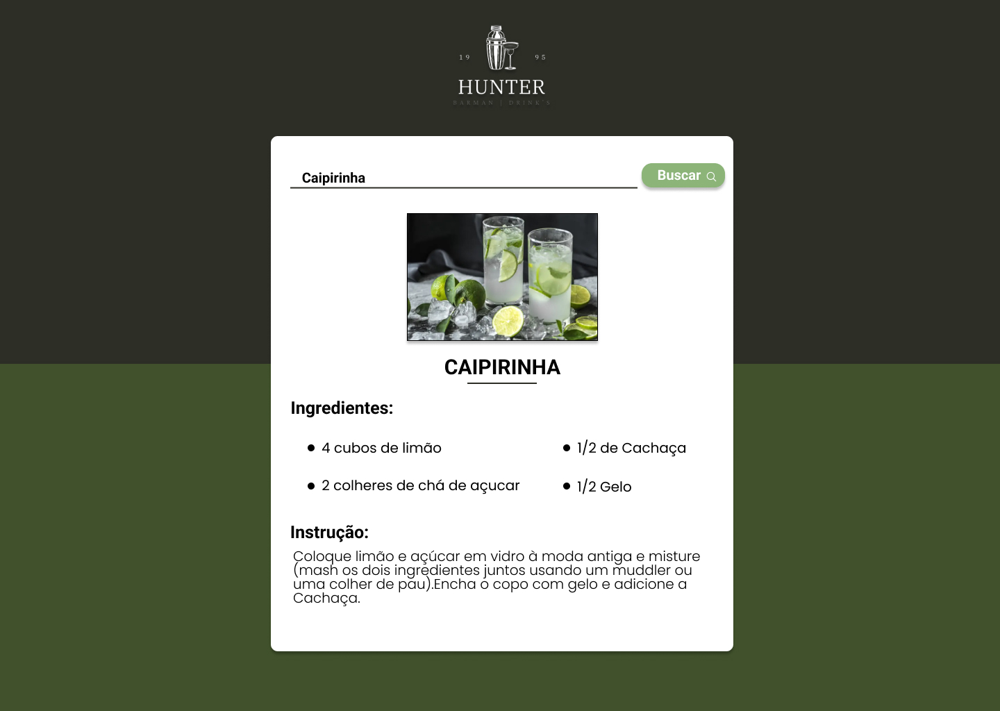

<h1 align="center"> Projeto - HunterDrinks 🍷 </h1>

Projeto Pessoal para estudos de tecnologias WEB.

 

  

🛠 Tecnologias

Esse projeto foi desenvolvido com as seguintes tecnologias:

- HTML e CSS
- JavaScript
- Git e Github
- API : https://www.thecocktaildb.com/api.php

📁 Projeto

Hunter Drinks é uma aplicação inovadora que não apenas procura o coquetel desejado, mas também fornece uma lista completa de todos os ingredientes necessários para a preparação do drink. Com uma interface intuitiva e amigável, nossa plataforma simplifica a experiência de criar bebidas deliciosas, garantindo que você tenha todos os elementos certos à mão para impressionar seus convidados ou desfrutar de um momento especial.

🖌 Layout

Você pode visualizar o layout do projeto através [DESSE LINK](https://www.figma.com/file/cjGkJUgMNNUWR6u4oOoP1R/HunterDrinks?type=design&node-id=10%3A29&mode=design&t=FGcPAqbSZpxU2NMp-1). É necessário ter conta no [Figma](https://figma.com) para acessá-lo.

Criado por Alan Barroncas
