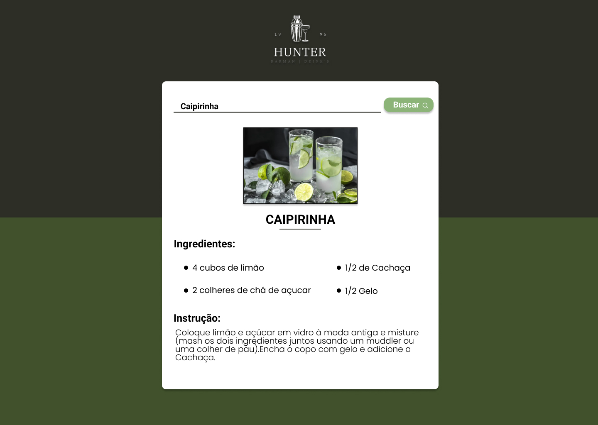

<h1 align="center"> Projeto - HunterDrinks 🍷 </h1>

<p align="center">
Projeto Pessoal para estudos de tecnologias WEB.
</p>


<br>

<p align="center">
  
</p>

🛠 Tecnologias

Esse projeto foi desenvolvido com as seguintes tecnologias:

<p>
  
  
  
  
  
  
</p>

- API : https://www.thecocktaildb.com/api.php

📁 Projeto

Hunter Drinks é uma aplicação inovadora que não apenas procura o coquetel desejado, mas também fornece uma lista completa de todos os ingredientes necessários para a preparação do drink. Com uma interface intuitiva e amigável, nossa plataforma simplifica a experiência de criar bebidas deliciosas, garantindo que você tenha todos os elementos certos à mão para impressionar seus convidados ou desfrutar de um momento especial.

🖌 Layout

Você pode visualizar o layout do projeto através [DESSE LINK](https://www.figma.com/file/cjGkJUgMNNUWR6u4oOoP1R/HunterDrinks?type=design&node-id=10%3A29&mode=design&t=FGcPAqbSZpxU2NMp-1). É necessário ter conta no [Figma](https://figma.com) para acessá-lo.


<br>

# HunterDrinks Monorepo 🚀

## Versões disponíveis

| Stack | Pasta | Status | Deploy |
|-------|-------|--------|--------|
| Vanilla HTML/JS | `vanilla/` | ✅ Original | GitHub Pages |
| Angular + API | `frontend-angular/` | 🔄 WIP | Vercel/Netlify |
| jQuery + Bootstrap | `frontend-jquery/` | ⏳ | - |
| PHP Backend | `backend-php/` | ⏳ | Heroku/XAMPP |

## Como rodar

### Vanilla (original)
```bash
# Abra vanilla/index.html no browser
